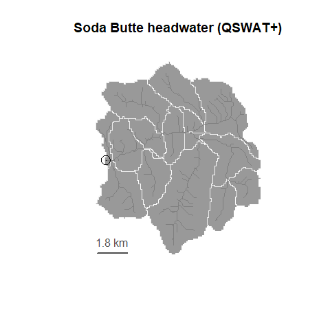

<!-- README.md is generated from README.Rmd. Please edit that file -->

# rswat

An R package for SWAT+ input/output file management

rswat edits and runs SWAT+ models. See our other project
[`rswat.maker`](https://github.com/deankoch/rswat.maker) for an R-based
workflow to build QSWAT+ projects and turn them into a SWAT+ models.

<!-- badges: start -->
<!-- badges: end -->

## Workflow

rswat uses R data frames to represent SWAT+ parameter tables on disk. We
provide tools to explore existing projects, search documentation,
execute simulations, train models, and view the results, all from within
the R-environment.

## Example

Check out our [Introduction
article](https://github.com/deankoch/rswat/blob/main/vignettes/articles/rswat_intro.md)
for a quick tour of the major features in rswat



## Installation

You can install the development version of rswat in R by doing:

``` r
devtools::install_github('deankoch/rswat')
```

Users who want to run simulations from rswat must also have a copy of
the SWAT+ simulator executable on their local machine (this is included
in the [SWAT+ installer](https://swat.tamu.edu/software/plus/)).
