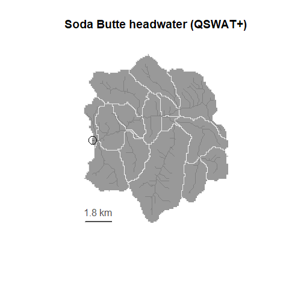

Getting started with rswat
================
Dean Koch
July 27, 2023

- [Introduction](#introduction)
- [Getting started](#getting-started)
  - [Open a project](#open-a-project)
- [Exploring SWAT+](#exploring-swat)
  - [File index](#file-index)
  - [Search](#search)
  - [Documentation](#documentation)
- [Editing](#editing)
  - [Open config files](#open-config-files)
  - [Open output files](#open-output-files)
  - [Modify parameters](#modify-parameters)
  - [Project state](#project-state)
- [Simulations](#simulations)
- [Applications](#applications)

# Introduction

This article explains how to use rswat to explore and manage a SWAT+
project. It picks up where the [Lamar River
tutorial](https://github.com/deankoch/rswat.maker/blob/master/vignettes/articles/lamar.md)
from [`rswat.maker`](https://github.com/deankoch/rswat.maker) left off,
by showing how to edit parameters and carry out simulations. Our example
code is for the small headwater catchment of Soda Butte Creek, near the
Silver Gate boundary in the northeast corner of Yellowstone National
Park.



# Getting started

Users will need a pre-existing SWAT+ project directory. This is a
collection of dozens to hundreds of plaintext config files, usually in a
directory called “TxtInOut” created by QSWAT+ and SWAT+ Editor. Check
out [`rswat.maker`](https://github.com/deankoch/rswat.maker) for an
R-based workflow to run these programs in batch mode.

It can be hard to track changes with so many files so we recommend
always working with backups, and include helper functions `rswat_backup`
and `rswat_restore` to make this easier. For the Soda Butte example we
will start by making a copy of our project directory (with path
`txt_dir`) in a temporary location (`dest_dir`) by passing their paths
to `rswat_restore`

``` r
# the source and destination directory names
basename(txt_dir)
#> [1] "TxtInOut"
basename(dest_dir)
#> [1] "soda_test"

# make the copy
txt_dir |> rswat_restore(dest_dir, overwrite=TRUE) |> head()
#> copying 222 file(s)
#> # A tibble: 6 × 4
#>   file            overwritten added completed
#>   <chr>           <lgl>       <lgl> <lgl>    
#> 1 aqu_catunit.ele FALSE       TRUE  TRUE     
#> 2 aqu_dr.swf      FALSE       TRUE  TRUE     
#> 3 aquifer.aqu     FALSE       TRUE  TRUE     
#> 4 aquifer.con     FALSE       TRUE  TRUE     
#> 5 aquifer_aa.txt  FALSE       TRUE  TRUE     
#> 6 aquifer_yr.txt  FALSE       TRUE  TRUE
```

## Open a project

Open any SWAT+ project by passing its path to `rswat`. The code below
loads the copy we just created

``` r
rswat(swat_dir=dest_dir, quiet=TRUE)
```

Here we have set `quiet` to disable the progress bar, which doesn’t
render well in markdown. Call `rswat` again without arguments to get a
summary of the project

``` r
rswat()
#> all requested files loaded
#> rswat summary
#> →  simulator: C:/SWAT/SWATPlus/SWATPlusEditor/resources/app.asar.unpacked/static/swat_exe/rev60.5.7_64rel.exe
#> →  directory: D:/rswat_data/swat/soda_test
#>    --------- 
#>  ⤷  file.cio: lists 63 config files in 19 groups 
#>    ⤷ climate: 15 stations in weather-sta.cli
#>        ⤷ wgn: simulating none
#>        ○ sta: pcp, tmp, slr, hmd, wnd (none loaded) 
#>  ⤷  time.sim: [ 2022-07-28 to 2023-07-28 ]
#>  ⤷ print.prt: [ 2022-07-28 to 2023-07-28 ]
#>    ⤷   daily: none
#>    ⤷ monthly: none
#>    ⤷  yearly: all
#>    ⤷   avann: all
```

The “all requested files loaded” here refers to optional arguments
`include` and `exclude` whose default settings skip loading certain
large files, like weather inputs, until they are needed. Read more about
this in `?rswat`.

# Exploring SWAT+

## File index

Get a list of all files in your SWAT+ project, loaded or not, using
`rswat_files`

``` r
rswat_files()
#> 222 files in D:/rswat_data/swat/soda_test
#> # A tibble: 222 × 10
#>    file           group      type   n_line n_var n_table        size modified            known loaded
#>    <chr>          <chr>      <chr>   <int> <int>   <int> [kilobytes] <dttm>              <lgl> <lgl> 
#>  1 file.cio       cio        config     29    18       1       3.4   2023-07-28 14:33:56 TRUE  TRUE  
#>  2 object.cnt     simulation config      1    21       1       0.661 2023-07-28 14:33:56 TRUE  TRUE  
#>  3 print.prt      simulation config     42    19       5       3.39  2023-07-28 14:33:56 TRUE  TRUE  
#>  4 time.sim       simulation config      1     5       1       0.169 2023-07-28 14:33:56 TRUE  TRUE  
#>  5 codes.bsn      basin      config      1    24       1       0.598 2023-07-28 14:33:56 TRUE  TRUE  
#>  6 parameters.bsn basin      config      1    44       1       1.3   2023-07-28 14:33:56 TRUE  TRUE  
#>  7 hmd.cli        climate    config     15     1       1       0.248 2023-07-28 14:33:56 TRUE  TRUE  
#>  8 pcp.cli        climate    config     15     1       1       0.259 2023-07-28 14:33:56 TRUE  TRUE  
#>  9 slr.cli        climate    config     15     1       1       0.291 2023-07-28 14:33:56 TRUE  TRUE  
#> 10 tmp.cli        climate    config     15     1       1       0.257 2023-07-28 14:33:56 TRUE  TRUE  
#> # ℹ 212 more rows
```

This can be filtered using a number of different criteria (read more
about this in `?rswat_files`)

``` r
rswat_files('climate')
#> 7 files in D:/rswat_data/swat/soda_test
#> # A tibble: 7 × 10
#>   file            group   type   n_line n_var n_table        size modified            known loaded
#>   <chr>           <chr>   <chr>   <int> <int>   <int> [kilobytes] <dttm>              <lgl> <lgl> 
#> 1 hmd.cli         climate config     15     1       1       0.248 2023-07-28 14:33:56 TRUE  TRUE  
#> 2 pcp.cli         climate config     15     1       1       0.259 2023-07-28 14:33:56 TRUE  TRUE  
#> 3 slr.cli         climate config     15     1       1       0.291 2023-07-28 14:33:56 TRUE  TRUE  
#> 4 tmp.cli         climate config     15     1       1       0.257 2023-07-28 14:33:56 TRUE  TRUE  
#> 5 weather-sta.cli climate config     15     9       1       3.41  2023-07-28 14:33:56 TRUE  TRUE  
#> 6 weather-wgn.cli climate config    298   173      13      31.9   2023-07-28 14:33:56 TRUE  TRUE  
#> 7 wnd.cli         climate config     15     1       1       0.271 2023-07-28 14:33:56 TRUE  TRUE
```

## Search

Once a file has been loaded, it becomes searchable with `rswat_find`.
This supports fuzzy matching to variable names, to help with typos and
names that have changed over time.

For example the potential evapotranspiration (PET) model flag, formally
called ‘IPET’ in SWAT2012, is now called ‘pet’. Searching for the old
name turns up no exact or substring matches (the default search mode).
However, with `fuzzy=2` we find the new name, plus one false positive

``` r
rswat_find(pattern='IPET', fuzzy=2)
#> 2 result(s) for "IPET" in 2 file(s) (searched 62)
#> looking up definitions...
#> # A tibble: 2 × 8
#>   file        group   table class     name  alias        match desc                                        
#>   <chr>       <chr>   <dbl> <chr>     <chr> <chr>        <chr> <chr>                                       
#> 1 codes.bsn   basin       1 integer   pet   ""           ***   Potential evapotranspiration (PET) method. …
#> 2 initial.cha channel     1 character pest  "pesticides" *     Pesticides initialization in channel (point…
```

Repeating the call with `fuzzy=1` produces the unique result ‘pet’.

We can see that this variable is stored in the file ‘codes.bsn’. Pass a
file name in `pattern` to report on all the variables in the file

``` r
rswat_find(pattern='codes.bsn')
#> 24 parameters(s) found in codes.bsn
#> looking up definitions...
#> # A tibble: 24 × 8
#>    file      group table class     name      alias     match desc                                          
#>    <chr>     <chr> <dbl> <chr>     <chr>     <chr>     <chr> <chr>                                         
#>  1 codes.bsn basin     1 character pet_file  "petfile" **    Potential ET filename                         
#>  2 codes.bsn basin     1 character wq_file   "wwqfile" **    Watershed stream water quality filename       
#>  3 codes.bsn basin     1 integer   pet       ""        ***   Potential evapotranspiration (PET) method. Th…
#>  4 codes.bsn basin     1 integer   event     ""        ***   Rainfall/runoff/routing option: 0   daily rai…
#>  5 codes.bsn basin     1 integer   crack     "crk"     *     Crack flow code. There are two options: 0 do …
#>  6 codes.bsn basin     1 integer   swift_out "subwq"   *     Subbasin water quality code. The algorithms u…
#>  7 codes.bsn basin     1 integer   sed_det   ""        ***   Code governing calculation of daily maximum h…
#>  8 codes.bsn basin     1 integer   rte_cha   "rte"     **    Channel water routing method: 0 variable stor…
#>  9 codes.bsn basin     1 integer   deg_cha   "deg"     **    Channel degradation code. There are two optio…
#> 10 codes.bsn basin     1 integer   wq_cha    "wq"      **    In-stream water quality code. The variable id…
#> # ℹ 14 more rows
```

By default `rswat_find` will attempt to match all results to definitions
(the `desc` field) from the SWAT+ inputs documentation PDF. As there is
some uncertainty in matching old and new names automatically to text
scraped from a PDF, a three-star match confidence ranking is reported by
`rswat_find` along with any aliases. When `alias` is an empty string it
means the function has found an exact match, and the definition is very
likely to be correct.

## Documentation

`rswat` includes a plaintext copy of the SWAT+ documentation PDF to make
it easy to access in an R environment. Call `rswat_docs` to get a
`tibble` of results for a search query. Searching for a file name will
usually pull up a full definitions list, along with some information
about where in the PDF this text can be found.

``` r
rswat_docs('codes.bsn')
#> 24 definition(s) found for codes.bsn
#> # A tibble: 24 × 5
#>     page  line file      name    desc                                                                      
#>    <int> <int> <chr>     <chr>   <chr>                                                                     
#>  1    18     6 codes.bsn petfile Potential ET filename                                                     
#>  2    18     7 codes.bsn wwqfile Watershed stream water quality filename                                   
#>  3    18     8 codes.bsn pet     Potential evapotranspiration (PET) method. There are four options for pot…
#>  4    18    24 codes.bsn event   Rainfall/runoff/routing option: 0   daily rainfall/curve number runoff/da…
#>  5    18    29 codes.bsn crk     Crack flow code. There are two options: 0 do not model crack flow in soil…
#>  6    19     2 codes.bsn subwq   Subbasin water quality code. The algorithms used to calculate loadings of…
#>  7    19    15 codes.bsn sed_det Code governing calculation of daily maximum half-hour rainfall value: 0  …
#>  8    19    27 codes.bsn rte     Channel water routing method: 0 variable storage method 1 Muskingum metho…
#>  9    19    34 codes.bsn deg     Channel degradation code. There are two options: 0 channel dimensions are…
#> 10    20     2 codes.bsn wq      In-stream water quality code. The variable identifies whether in-stream t…
#> # ℹ 14 more rows
```

Variable names can also be searched in `rswat_docs`. For example the
pattern ‘IPET’ turns up a different parameter name and location: ‘ipet’
in the ‘hru-lte.hru’ file.

``` r
rswat_docs('IPET')
#> "IPET" matched to 1 parameter(s) in 1 file(s)
#> # A tibble: 1 × 5
#>    page  line file        name  desc                                                                       
#>   <int> <int> <chr>       <chr> <chr>                                                                      
#> 1    88    19 hru-lte.hru ipet  Potential evapotranspiration (PET) method (character): ‘harg’ = Hargreaves…
```

Our example is not an “LTE”-type project, so we don’t have ‘hru-lte.hru’
in our project directory. `rswat_docs` will find the match but
`rswat_find`, which searches only loaded files, will not.

Those who are new to SWAT+,or have trouble remembering its many variable
names, can also search definition text for matches to keywords by
setting `defs=TRUE`. For example, the search pattern
‘evapotranspiration’ turns up both of the IPET-type parameters, along
with a few other results for related processes

``` r
rswat_docs('evapotranspiration', defs=TRUE)
#> "evapotranspiration" matched to 7 definition(s) in 5 file(s)
#> # A tibble: 7 × 5
#>    page  line file          name   desc                                                                    
#>   <int> <int> <chr>         <chr>  <chr>                                                                   
#> 1   127     2 hydrology.hyd cncoef "Plant ET curve number coefficient. ET weighting coefficient used to ca…
#> 2   123    18 hydrology.hyd canmx  "Maximum canopy storage (mm H2O). The plant canopy can significantly af…
#> 3    88    19 hru-lte.hru   ipet   "Potential evapotranspiration (PET) method (character): ‘harg’ = Hargre…
#> 4    18     8 codes.bsn     pet    "Potential evapotranspiration (PET) method. There are four options for …
#> 5    20    14 codes.bsn     cn     "Daily curve number calculation method: 0 calculate daily CN value as a…
#> 6   119    21 aquifer.aqu   revap  "Groundwater \"revap\" coefficient. Water may move from the shallow aqu…
#> 7   151    14 plants.plt    gsi    "Maximum stomatal conductance at high solar radiation and low vapor pre…
```

# Editing

So far we have only explored the structure of an existing project. But
the real power of rswat is in allowing R users to edit projects by
easily reading and modifying the parameters in the SWAT+ config files on
disk. rswat makes this simple and intuitive for R users by representing
all config files as data frames

## Open config files

To open a file, pass the file name to `rswat_open`. For example, the
‘time.sim’ file controls the time period of simulations, and consists of
a single, one-line table. `rswat_open` returns it as a single data frame

``` r
rswat_open('time.sim') |> str()
#> 'data.frame':    1 obs. of  5 variables:
#>  $ day_start: int 209
#>  $ yrc_start: int 2022
#>  $ day_end  : int 209
#>  $ yrc_end  : int 2023
#>  $ step     : int 0
#>  - attr(*, "rswat_path")= chr "D:/rswat_data/swat/soda_test"
#>  - attr(*, "rswat_fname")= chr "time.sim"
#>  - attr(*, "rswat_table_num")= int 1
```

Most SWAT+ config files have this very simple single-table structure.
The few multi-table exceptions, such as `print.prt`, are returned as a
list of data frames. For example this code prints the first two tables

``` r
rswat_open('print.prt') |> head(2)
#> [[1]]
#>   nyskip day_start yrc_start day_end yrc_end interval
#> 1      1         0         0       0       0        1
#> 
#> [[2]]
#>   aa_int_cnt
#> 1          0
```

## Open output files

Outputs are tabular so they can be browsed the same way as config files,
using `rswat_files` and `rswat_open`. For example, the yearly water
balance file in our example looks like this

``` r
rswat_open('basin_wb_yr.txt') |> rswat_date_conversion() |> dplyr::tibble()
#> # A tibble: 1 × 44
#>   date        unit gis_id name     precip snofall snomlt surq_gen  latq wateryld  perc    et ecanopy eplant
#>   <date>     <int>  <int> <chr>     <dbl>   <dbl>  <dbl>    <dbl> <dbl>    <dbl> <dbl> <dbl>   <dbl>  <dbl>
#> 1 2023-07-28     1      1 Drswat_…   692.    403.   524.     67.7  14.5     82.2  46.4  105.    11.7   55.4
#> # ℹ 30 more variables: esoil <dbl>, surq_cont <dbl>, cn <dbl>, sw_init <dbl>, sw_final <dbl>,
#> #   sw_ave <dbl>, sw_300 <dbl>, sno_init <dbl>, sno_final <dbl>, snopack <dbl>, pet <dbl>, qtile <dbl>,
#> #   irr <dbl>, surq_runon <dbl>, latq_runon <dbl>, overbank <dbl>, surq_cha <dbl>, surq_res <dbl>,
#> #   surq_ls <dbl>, latq_cha <dbl>, latq_res <dbl>, latq_ls <dbl>, gwtranq <dbl>, satex <dbl>,
#> #   satex_chan <dbl>, sw_change <dbl>, lagsurf <dbl>, laglatq <dbl>, lagsatex <dbl>, wet_out <dbl>
```

`dplyr::tibble` is useful for printing these results in R, as the output
tables are often very long (for daily outputs at least) and too wide to
print without wrapping. `rswat_date_conversion` translates the Julian
date columns to an R Date column.

## Modify parameters

The ‘print.prt’ file is a good place to start editing as it controls
which time period to print to the output files. The result will be
immediately obvious the next time you run a simulation.

In the earlier `rswat()` summary, and in the existing output file above,
we can see that the print period is currently set to a single date. This
is because ‘print.prt’ is currently configured for a one year long
burn-in period during which the output is muted. The code below shows
how to remove this burn-in period via its parameter `nyskip`.

``` r
rswat_find('nyskip')
#> 1 result(s) for "nyskip" in 1 file(s) (searched 62)
#> looking up definitions...
#> all variable names matched exactly
#> # A tibble: 1 × 8
#>   file      group      table class   name   alias match desc                                               
#>   <chr>     <chr>      <dbl> <chr>   <chr>  <chr> <chr> <chr>                                              
#> 1 print.prt simulation     1 integer nyskip ""    ***   "Number of years to not print output. The options …
```

To modify a parameter, get a copy of its data frame with `rswat_open`,
change its value, and pass the data frame back to `rswat_write`

``` r
# copy the relevant table
prt = rswat_open('print.prt')[[1]]

# assign new values
prt[['nyskip']] = 0L
prt |> rswat_write(overwrite=TRUE)
#> 1 field(s) modified in print.prt
#> writing changes to D:/rswat_data/swat/soda_test/print.prt
#> # A tibble: 1 × 7
#>   file      name   table line_num field_num value replacement
#>   <chr>     <chr>  <dbl>    <int>     <int> <chr> <chr>      
#> 1 print.prt nyskip     1        3         1 1     0
```

Calling `rswat_write` with default `overwrite=FALSE` will report the
pending changes but not write them

## Project state

Changes written with `rswat_write` persist in the files on disk, and
subsequent calls to `rswat_open` will return the newest version.
`rswat()` calls will also reflect the current state on disk

``` r
rswat()
#> all requested files loaded
#> rswat summary
#> →  simulator: C:/SWAT/SWATPlus/SWATPlusEditor/resources/app.asar.unpacked/static/swat_exe/rev60.5.7_64rel.exe
#> →  directory: D:/rswat_data/swat/soda_test
#>    --------- 
#>  ⤷  file.cio: lists 63 config files in 19 groups 
#>    ⤷ climate: 15 stations in weather-sta.cli
#>        ⤷ wgn: simulating none
#>        ○ sta: pcp, tmp, slr, hmd, wnd (none loaded) 
#>  ⤷  time.sim: [ 2022-07-28 to 2023-07-28 ]
#>  ⤷ print.prt: [ 2022-07-28 to 2023-07-28 ]
#>    ⤷   daily: none
#>    ⤷ monthly: none
#>    ⤷  yearly: all
#>    ⤷   avann: all
```

Notice the summary shows the updated print range (which now matches
‘time.sim’).

rswat uses a reference class (R5) internally to keep an up-to-date
database of information on the loaded SWAT+ project. This is important
as it allows all rswat function to have a common knowledge about the
state of the files on disk without passing big lists around in function
calls, and it allows us to more easily implement a cache to speed up
text parsing/writing.

The data frames returned by `rswat_open`, however, are ordinary R data
frames with copy-on-modify semantics. This means rswat will not “know”
that you have modified a table until you write the change to disk with
`rswat_write`.

# Simulations

For running simulations, rswat uses `shell` to call the simulator
executable. Users will need to supply their local path to this (.exe)
file by passing it as argument `exe_path` in an `rswat` call.

``` r
rswat(exe_path=swat_path)
#> all requested files loaded
#> rswat summary
#> →  simulator: C:/SWAT/SWATPlus/SWATPlusEditor/resources/app.asar.unpacked/static/swat_exe/rev60.5.7_64rel.exe
#> →  directory: D:/rswat_data/swat/soda_test
#>    --------- 
#>  ⤷  file.cio: lists 63 config files in 19 groups 
#>    ⤷ climate: 15 stations in weather-sta.cli
#>        ⤷ wgn: simulating none
#>        ○ sta: pcp, tmp, slr, hmd, wnd (none loaded) 
#>  ⤷  time.sim: [ 2022-07-28 to 2023-07-28 ]
#>  ⤷ print.prt: [ 2022-07-28 to 2023-07-28 ]
#>    ⤷   daily: none
#>    ⤷ monthly: none
#>    ⤷  yearly: all
#>    ⤷   avann: all
```

In the latest release the simulator file for Windows is called
‘rev60.5.7_64rel.exe’ and it can be found in the
‘SWAT/SWATPlus/SWATPlusEditor’ directory tree. Standalone versions can
also be downloaded.

Note that most of the package functions will work without setting this
path, which means rswat still functions as an editor without a working
SWAT+ installation. Once the path is set, users can call `rswat_exec()`
to run the simulator and write output to the project directory.

``` r
rswat_exec()
#> SWAT+ simulation finished in 3.45 seconds
#> 7 log and 64 output and 10 unknown files were written
#> # A tibble: 81 × 2
#>    file             type  
#>    <chr>            <chr> 
#>  1 area_calc.out    log   
#>  2 checker.out      log   
#>  3 diagnostics.out  log   
#>  4 erosion.out      log   
#>  5 files_out.out    log   
#>  6 simulation.out   log   
#>  7 success.fin      log   
#>  8 aquifer_aa.txt   output
#>  9 aquifer_yr.txt   output
#> 10 basin_aqu_aa.txt output
#> # ℹ 71 more rows
```

The function returns a list of output files written when it finishes. If
we open the yearly water balance file again, we can see that the results
from 2022 (formerly a hidden burn-in year) now appear in the output, as
a result of our earlier change to ‘print.prt’.

``` r
rswat_open('basin_wb_yr.txt') |> rswat_date_conversion() |> dplyr::tibble()
#> # A tibble: 2 × 44
#>   date        unit gis_id name     precip snofall snomlt surq_gen  latq wateryld  perc    et ecanopy eplant
#>   <date>     <int>  <int> <chr>     <dbl>   <dbl>  <dbl>    <dbl> <dbl>    <dbl> <dbl> <dbl>   <dbl>  <dbl>
#> 1 2022-12-31     1      1 Drswat_…   370.    184.   58.2     1.26  5.52     6.78  10.6  170.    20.0  120. 
#> 2 2023-07-28     1      1 Drswat_…   692.    403.  524.     67.7  14.5     82.2   46.4  105.    11.7   55.4
#> # ℹ 30 more variables: esoil <dbl>, surq_cont <dbl>, cn <dbl>, sw_init <dbl>, sw_final <dbl>,
#> #   sw_ave <dbl>, sw_300 <dbl>, sno_init <dbl>, sno_final <dbl>, snopack <dbl>, pet <dbl>, qtile <dbl>,
#> #   irr <dbl>, surq_runon <dbl>, latq_runon <dbl>, overbank <dbl>, surq_cha <dbl>, surq_res <dbl>,
#> #   surq_ls <dbl>, latq_cha <dbl>, latq_res <dbl>, latq_ls <dbl>, gwtranq <dbl>, satex <dbl>,
#> #   satex_chan <dbl>, sw_change <dbl>, lagsurf <dbl>, laglatq <dbl>, lagsatex <dbl>, wet_out <dbl>
```

# Applications

`rswat_open`, `rswat_write`, and `rswat_exec` is a powerful combination.
It allows users to programmatically control virtually all aspects of a
SWAT+ simulation. In the next vignette we give a few examples, showing
how to calibrate a forecasting model for the Soda Butte catchment.
